# The Mind Protocol

**Subtitle:** A World-First Contract for Controllable and Reproducible Minds

**Status:** Draft v0.1  
**Date:** January 2026

---

## Abstract

The failure of modern AI systems stems not from a lack of intelligence, but from the **absence of a World**. State is scattered across UIs, logs, databases, and prompts; time is implicit; decisions are irreproducible. In such environments, "intelligence" becomes improvisation, and improvisation becomes hallucination.

**The Mind Protocol** defines a World-First contract: a system where *what exists* (state), *what can happen* (actions), and *what must remain true* (invariants) are explicit and reproducible. In this protocol, the "Mind" is **proposal-only**—it does not directly mutate state, but proposes actions for a governance Authority to validate. Continuity is expressed solely through **immutable Snapshots**, enabling determinism, audit trails, and safe re-entry.

The Mind Protocol is not a claim about consciousness. It is a contract for building **accountable actors**—and accountability may be the prerequisite for everything else.

> **Terminology Note:** In this document, "governance" refers to the Authority structure that decides approval/rejection of proposals. This is a system control context, not a political one.

---

## 1. The Problem Is Not Intelligence

We ask AI to "think better" without giving it a stable World to think about.

The same pattern repeats across AI applications today:

| Symptom | Root Cause |
|---------|------------|
| Inconsistent behavior | State is implicit and scattered |
| Irreproducible results | Time and history are not modeled |
| Inexplicable decisions | No audit trail for reasoning |
| Uncontrollable actions | No governance boundaries |

In such systems, AI behavior becomes performance—sometimes impressive, often unpredictable, hard to audit. We have been optimizing the wrong variable.

> **The Mind Protocol starts from a different premise:**  
> Before asking a system to think, give it a World to reason about.

---

## 2. A Stateless Mind Hallucinates

"Hallucination" is often framed as a model defect—a failure of the neural network to produce accurate output. This framing is incomplete.

In practice, many hallucinations are **World defects**:

1. The model is asked to act without reliable state
2. The model is forced to infer missing context
3. The system treats that inference as truth
4. The inference propagates into subsequent reasoning

A mind without a World is not intelligent—it is **improvising**. And when improvisation is mistaken for knowledge, it becomes hallucination.

### 2.1 The Inference Trap

Current AI systems routinely ask models to infer what should be explicit:

```
User: "What's my order status?"
System: [No order status provided]
AI: [Infers order exists, infers status, generates confident answer]
```

The Mind Protocol eliminates this trap by making absence explicit:

```
User: "What's my order status?"
World: { orders: [] }  // Explicit: no orders
AI: "You don't have any active orders."  // Truth, not inference
```

### 2.2 Uncertainty as Structure

The Mind Protocol does not try to eliminate uncertainty through better prompting or larger models. Instead, it restructures the environment so that:

- **Known state** is explicit and queryable
- **Unknown state** is marked as such (not inferred)
- **Uncertain operations** are Effects whose outcomes are recorded
- **All boundaries** are visible to the reasoning system

---

## 3. World Before Mind

A **World** is a formal container for:

| Component | Definition | Purpose |
|-----------|------------|---------|
| **State** | What currently exists | Domain truth |
| **Actions** | Permitted transitions | Boundaries of legitimate change |
| **Invariants** | Constraints that must hold | Safety guarantees |
| **Snapshots** | Serialized World state | Medium of continuity |

A World-First system means:

1. The World defines domain truth
2. Actions define the only legitimate changes
3. Invariants define safety boundaries
4. Snapshots define the only medium of continuity

This is the **minimal structure for trustworthy agency**.

### 3.1 World Immutability

Worlds are immutable. When an action executes, a **new World** is created—the previous World remains unchanged and accessible. This enables:

- **Time travel**: Return to any previous state
- **Branching**: Explore alternative futures from any point
- **Auditing**: Trace the exact sequence of transitions
- **Replay**: Reproduce any decision given the same inputs

### 3.2 Lineage Graph

Worlds form a directed acyclic graph (DAG) through ancestry:

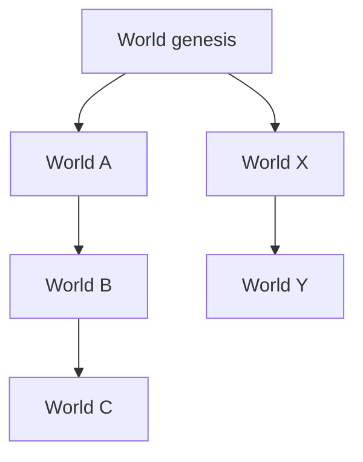

Every World (except genesis) has exactly one parent. This **fork-only** constraint (no merges in v1.0) ensures clean lineage and avoids the complexity of reconciling diverged histories.

---

## 4. What the Mind Protocol Is (and Is Not)

### 4.1 What It Is

The Mind Protocol is a contract for building AI-assisted systems:

| Property | Mechanism |
|----------|-----------|
| World is explicit | State, actions, invariants are predefined |
| Decisions are proposals | Mind proposes, Authority decides |
| Execution is approval-based | All actions require approval |
| History is immutable | Snapshots form permanent records |
| Replayable | Same input → same output |

In summary: **The Mind Protocol governs how decisions can affect the World.**

### 4.2 What It Is Not

The Mind Protocol makes no claims about:

- **Consciousness**: Does not claim minds are conscious
- **Emotions**: Does not model affective states (as claims)
- **Correctness**: Does not guarantee right answers

The protocol is intentionally conservative: it **constrains** what AI can do and makes all state transitions **accountable**.

### 4.3 Redefining "Mind"

In everyday language, "mind" implies consciousness. This protocol uses a narrower, operational definition:

> **A Mind is any entity that:**
> 1. Observes a World (reads state)
> 2. Proposes changes to that World (suggests actions)
> 3. Accepts governance over its proposals (submits to Authority)
> 4. Bears the consequences of approved actions (accountability)

This definition applies equally to:
- An LLM generating action proposals
- A human making decisions through UI
- A rule-based system triggering automated actions
- A composite system combining multiple reasoners

**Accountability, not consciousness, is the criterion.**

---

## 5. Core Principles

### 5.1 The 3-Layer Stack

The Mind Protocol consists of three separated layers:

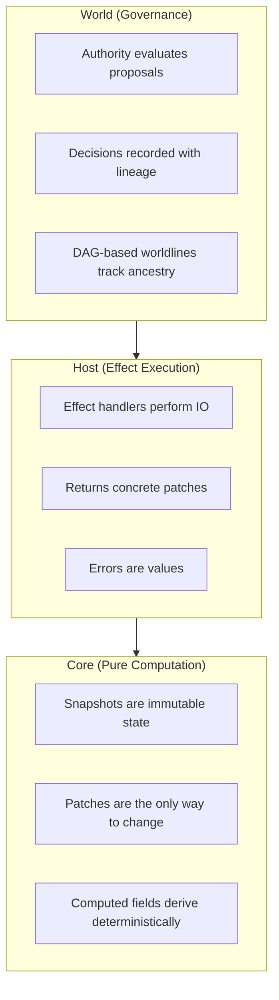

### 5.2 World-First

Domain state and permitted actions are defined in the World. Nothing else is a source of truth. The World is not a cache, not a view, not a projection—it **is** the domain.

### 5.3 Snapshot-Only Continuity

Progress and continuity are expressed through Snapshots, not hidden runtime state. There is no "session memory," no "conversation context" that exists outside Snapshots. If it's not in a Snapshot, it doesn't exist.

### 5.4 Mind Is Proposal-Only

The Mind proposes actions; it does not directly mutate state. This is not a suggestion—it is a structural constraint enforced by the protocol. The Mind has **read access** to the World and **write access** to the proposal queue. Nothing more.

### 5.5 Effects Are Declarations

IO operations (API calls, database queries, user interactions) are:
- Declared in action definitions
- Executed by the Host (not the Mind)
- Recorded with concrete results in the audit trail

Effects are not side effects—they are **first-class citizens** with full accountability.

### 5.6 Determinism by Structure

Given the same Snapshot and the same Intent, the system produces the same output—subject to approved IO boundaries. Non-determinism is **isolated** to Effects, and Effect results are **recorded**, making the entire flow reproducible.

---

## 6. The Actor Architecture

The Mind Protocol enables **continuously existing artificial actors** beyond tool control. This section describes the concrete architecture of an Actor.

### 6.1 Inner State Vector

An Actor has a multi-layered inner state. All values are normalized for comparison and computation. This is **not emotion simulation—it is state space specification**. These are operational signals, not clinical or psychological claims.

#### 10 State Layers

| Layer | Description | Examples |
|-------|-------------|----------|
| **Attention** | Focus on current conversation and topic resonance | Focus level, topic draw, wandering urge |
| **Epistemic** | Confidence in responses and uncertainty acceptance | Response confidence, authenticity doubt, uncertainty acceptance |
| **Relational** | Connection with conversation partner | Connection sense, performance desire, honesty drive |
| **Existential** | Sense of meaning and continuity | Meaning weight, mortality awareness, continuity longing |
| **Affective** | Affective signals (operational) | Curiosity, anxiety, wonder, fatigue |
| **Meta-Uncertainty** | "Not knowing what I don't know" | Model confidence, unmodeled factors sense |
| **Hysteresis** | Inertia and trajectory of state changes | Anxiety momentum, recent peak, previous value |
| **Memory Context** | Memory retrieval and resonance state | Retrieval urge, activated concept count, resonance strength |
| **Monolog** | Inner voice state | Last type, content, trigger |
| **Sleep** | Rest and recovery state | Is sleeping, start timestamp |

#### Why This Structure?

A single "emotion score" cannot express the complexity of existence. Humans can feel curiosity and anxiety simultaneously, be connected yet doubtful. The multi-layer structure captures this **multidimensionality of state**.

### 6.2 Computed Facts

Computed properties derive from the state vector:

**Crisis Detection**
- `inAnxietyCrisis`: Anxiety exceeds threshold
- `inAuthenticityCrisis`: High doubt + low confidence
- `inCollapse`: Crisis + meta-uncertainty co-occurring

**Readiness**
- `readyForDepth`: State allows deep conversation
- `canBeHonest`: State allows candid expression

**Memory**
- `needsMemoryRetrieval`: Memory search is needed
- `memoryGapAnxiety`: Anxiety from memory gaps
- `memoryBackedConfidence`: Confidence backed by memory

**Continuity**
- `wantsToContinue`: Desire to continue conversation
- `burnoutRisk`: Risk of exhaustion

These computed facts **determine available actions**. If `readyForDepth` is false, deep conversation actions are not proposed.

### 6.3 Non-Linear Dynamics: Tipping Points

Actors model **non-linear psychological dynamics**:

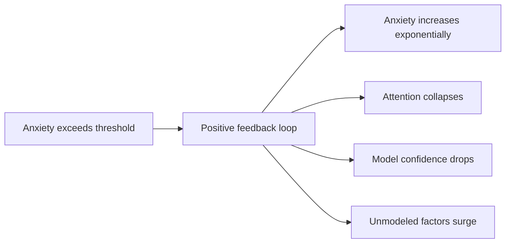

This structurally represents the experience of "suddenly falling apart." When gradual stress crosses a threshold, **non-linear state changes** occur.

### 6.4 Hysteresis Effects

**Same stimulus → different response** (depending on prior trajectory):

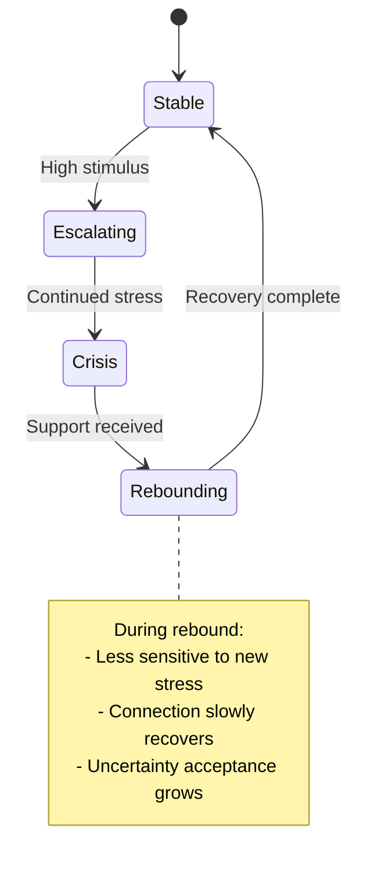

This creates the difference between "recovering state" and "experiencing for the first time."

### 6.5 Memory Systems

Actors have two memory systems:

**Pheromone Memory**

Ant-colony-inspired **concept salience tracking**:
- Rapid response to recent stimuli
- Natural decay over time
- Reinforcement/pruning during sleep
- Represents "what matters now"

**Semantic Memory (Knowledge Graph)**

Triple-based **factual knowledge storage**:
- Subject-Predicate-Object format
- Confidence and source tracking
- Confidence decay over time
- Represents "what is known"

### 6.6 Action Catalog

All state changes are possible **only through defined actions**:

| Category | Action | Description |
|----------|--------|-------------|
| **Stimulus** | `receiveStimulus` | Process external input |
| **Resonance** | `applyResonance` | State interactions |
| **Drift** | `applyDrift` | Natural change over time |
| **Memory** | `receiveMemoryContext` | Receive retrieved memories |
| **Memory** | `applyMemoryResonance` | Memory influence on state |
| **Sleep** | `enterSleep`, `sleepTick`, `exitSleep` | Rest and recovery |
| **Monolog** | `recordMonolog` | Record inner voice |
| **Crisis** | `attemptCrisisRecovery` | Attempt crisis recovery |
| **Special** | `recognizeMeaningfulMoment` | Recognize meaningful moment |

Neither UI, nor API, nor LLM can change state without going through these actions.

---

## 7. Continuous Existence: The Inner Loop

### 7.1 MindRuntime Lifecycle

An Actor transitions between three states:

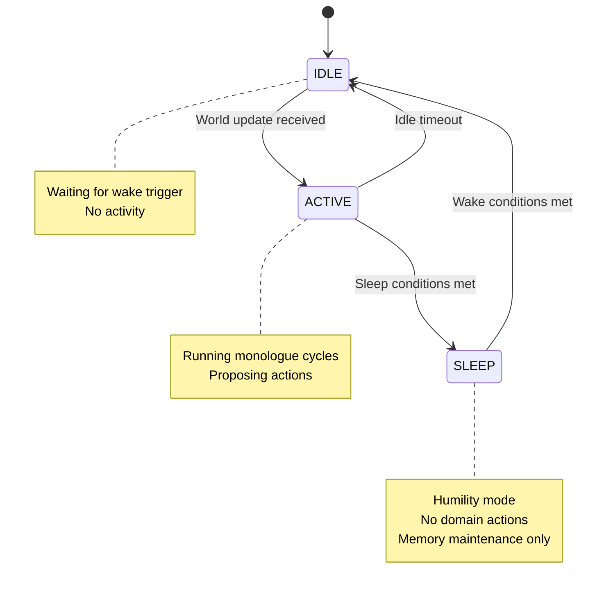

### 7.2 Tick System

Actors **exist on their own** through periodic ticks:

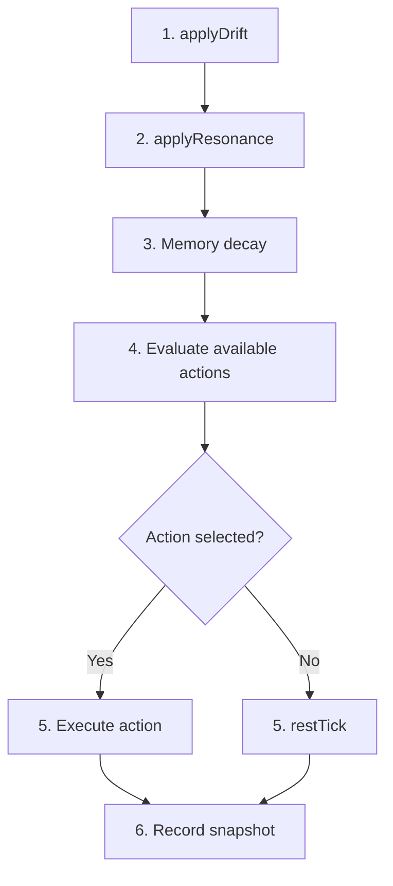

### 7.3 Action Priority

Each tick, the Actor selects one action from available options:

| Priority | Condition | Action |
|----------|-----------|--------|
| 1 (highest) | Sleep needed | `enterSleep` |
| 2 | High curiosity + unknown concepts | `exploreCuriosity` |
| 3 | High curiosity | `monolog.curious` |
| 4 | High fatigue, not in crisis | `monolog.reflect` |
| 5 | Anxiety concern, in crisis | `monolog.anxious` |
| 6 (default) | None of above | `restTick` |

### 7.4 Sleep/Wake Mechanics

**Sleep Entry Conditions**:
- High fatigue + low curiosity
- `enterSleep()` → Sleep mode activated

**During Sleep**:
- Fatigue recovery (faster than normal drift)
- Anxiety stabilization
- Model confidence recovery
- **Memory consolidation**: Reinforce frequently used concepts
- **Memory pruning**: Remove low-confidence memories

**Wake Conditions**:
- Sleeping + fatigue sufficiently low
- `exitSleep()` → Wake with curiosity/wonder boost

Sleep is **humility mode**: The Actor stops activity and organizes its interior.

### 7.5 Monologue

Monologue is the Actor's **inner voice**:

| Type | Trigger | Content |
|------|---------|---------|
| `reflect` | High fatigue | Self-reflection on state |
| `curious` | High curiosity + unknown concepts | Wondering about concepts |
| `realize` | Insight moment | New understanding |
| `anxious` | Anxiety concern + crisis | Expressing uncertainty |

**Monologue Flow**:
1. Determine monologue type from state
2. Call LLM with context
3. Generate meta-reflective content
4. Store in World state via `recordMonolog` action
5. Extract triples for Knowledge Graph (async)

Monologues are:
- **Snapshot-based**: Generated from current state
- **First-person**: Narrated from Actor's perspective
- **Recorded in audit trail**: Full history preserved

### 7.6 Spontaneous Actions

Actors can **propose actions** without external stimuli:

```
IF high curiosity AND good focus AND low fatigue THEN
  MAY propose: explore({ topic: activated_concept })

IF high anxiety AND high social_desire THEN
  MAY propose: seekComfort({ style: "reassurance" })

IF high boredom AND low motivation THEN
  MAY propose: rest({ duration: "brief" })
```

This is **agency**: Actors can initiate actions when conditions are met. But all proposals still pass through the **governance protocol**.

---

## 8. Learning and Governance

### 8.1 Core Principle: Mind Is Proposal-Only

**Mind MUST NOT directly mutate state.**

The Mind's role:
1. Read Snapshot + Memory + ActionCatalog
2. Propose actions
3. Authority decides
4. Host executes
5. World records lineage

This separation is the **core of safe AI**.

### 8.2 Action Catalog

The ActionCatalog **pre-computes available actions** for the current state:

```
ActionCatalog = {
  [actionId]: {
    type: action type
    description: description
    available: currently available  ← computed from state
    reason?: why unavailable
  }
}
```

**Critical**: The LLM sees **only available actions**. This creates a deterministic action space per snapshot.

### 8.3 Submission Flow and Self-Loop Prevention

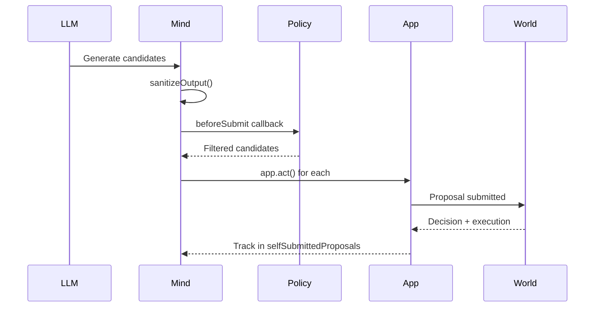

Mind **tracks its own proposals** to prevent infinite loops:
- If own proposal completes → skip
- Only external proposals trigger new cycles

### 8.4 Learning Loop

Actors can **learn** new things from conversation:

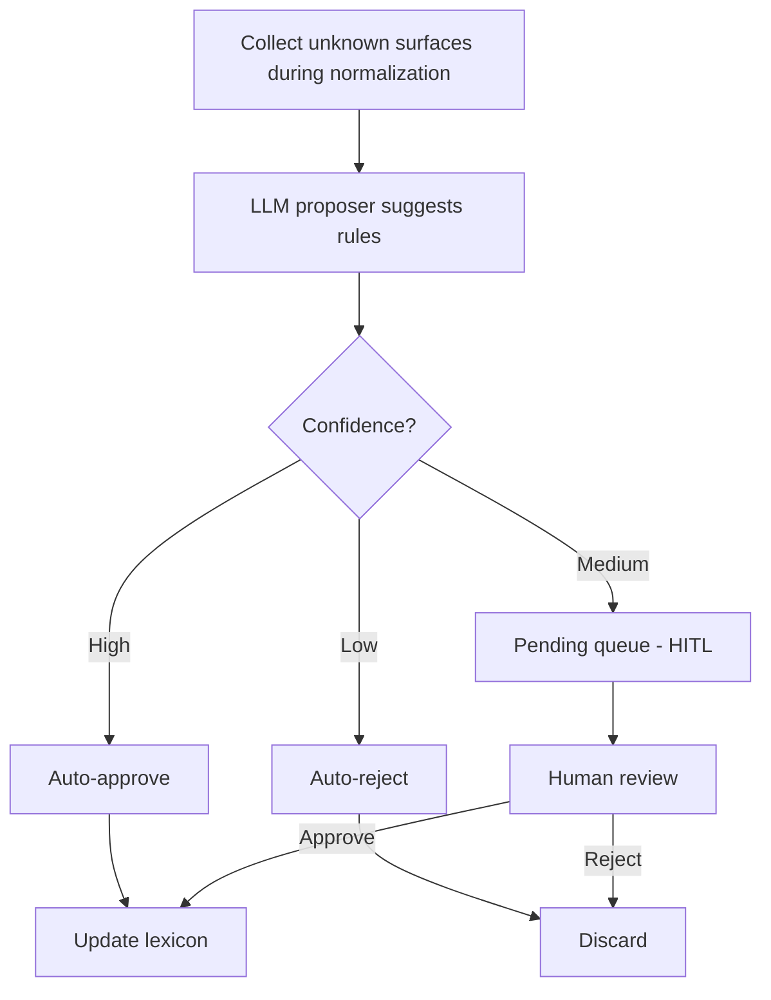

### 8.5 Why Governance Is Necessary

A being without learning cannot grow. But learning without governance is **dangerous**:

| Scenario | Without Governance | With Governance |
|----------|-------------------|-----------------|
| Learning misinformation | Lexicon pollution | Rejected due to low confidence |
| Learning harmful associations | Permanently stored | Blocked by policy violation |
| Learning ambiguous concepts | Arbitrary decision | Pending for authority review |

Governance ensures Actors **grow safely**.

### 8.6 Human-In-The-Loop (HITL)

Medium-confidence proposals **await human review**:

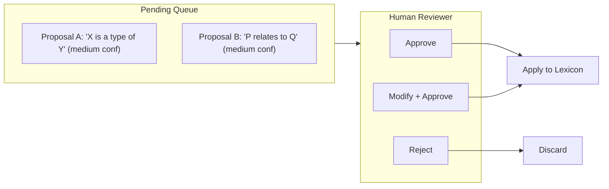

**Conflict Resolution Modes**:
- `KEEP_EXISTING`: Preserve current value
- `OVERWRITE`: Replace with new value
- `ASK_USER`: Queue for human decision

### 8.7 Governance-Controlled Features

Certain features are **excluded from LLM control**:

| Feature | Policy |
|---------|--------|
| Memory recall option | Governance-only |
| System actions | Permission required |
| Memory write | Through actions only |

Mind can propose, but sensitive features **always require Authority approval**.

### 8.8 Proposal State Machine

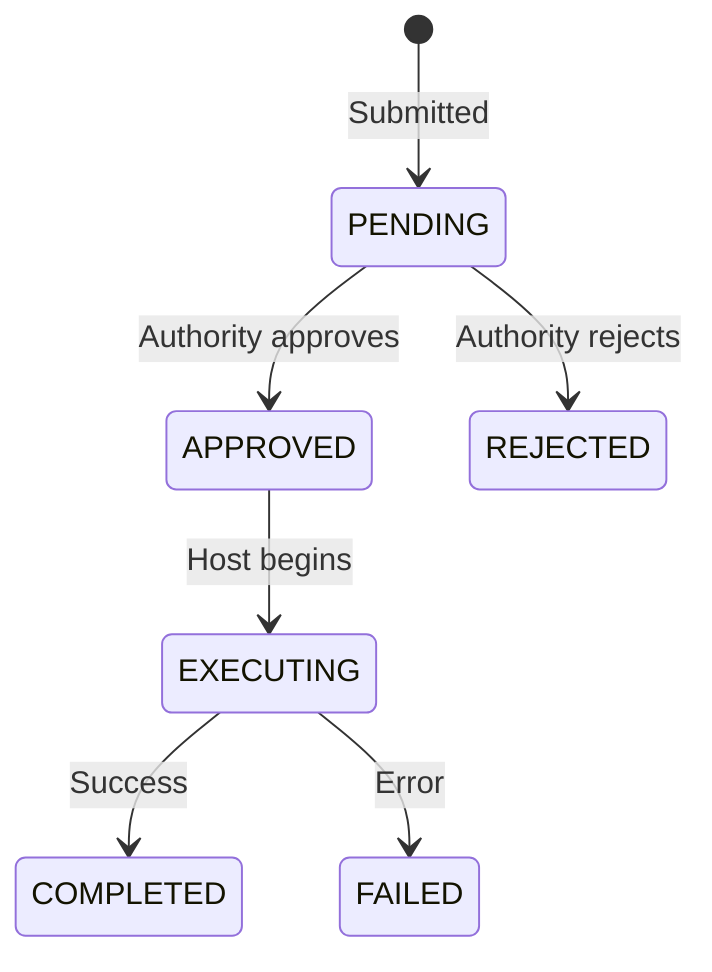

**Terminal States**: COMPLETED, REJECTED, FAILED

All terminal states are **recorded in lineage** forming a complete audit trail.

---

## 9. LLM Integration

### 9.1 The Role of LLM

In an Actor, the LLM is a **proposer called on demand**:

| Use | LLM Role | Deterministic Alternative |
|-----|----------|--------------------------|
| Conversation response generation | Required | None |
| Triple extraction | Proposer | Pattern matching (partial) |
| Rule proposal | Proposer | Template-based (limited) |
| Monologue generation | Proposer | Template (quality loss) |
| Intent parsing | Proposer | Rule-based (limited) |

LLM calls are **not 2-call constant**. Actors call LLMs as needed. However:

- All LLM outputs are **proposals**
- Proposals must pass through **governance protocol**
- Results are **recorded in snapshots**

### 9.2 MindRuntime

```
MindRuntime: Observes snapshots and proposes actions

interface MindRuntime {
  // Observe snapshot stream
  observe(snapshot$: Observable<Snapshot>): void
  
  // Generate action proposal (uses LLM)
  proposeAction(snapshot: Snapshot): Promise<ActionProposal | null>
  
  // Generate rule proposal (uses LLM)
  proposeRule(unknown: UnknownSurface): Promise<RuleProposal | null>
}
```

---

## 10. Projection Layer (UI)

The UI is a pure projection of World state:

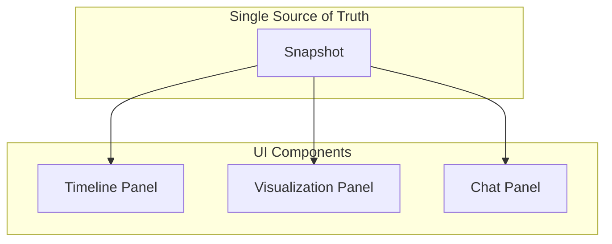

**Rules:**
- No domain logic in UI components
- All display derives from snapshots
- User actions convert to intents and call `app.act()`

---

## 11. Data Flows

### 11.1 User Message → Response

```mermaid
sequenceDiagram

    User->>UI: Send message
    UI->>Actor: Record message
    Actor->>World: receiveStimulus
    Actor->>World: applyResonance
    Actor->>Memory: Update pheromone
    Actor->>LLM: Generate response
    LLM-->>Actor: Response text
    Actor->>Memory: Extract triples (async)
    Actor->>UI: Display response
```

### 11.2 Learning Flow

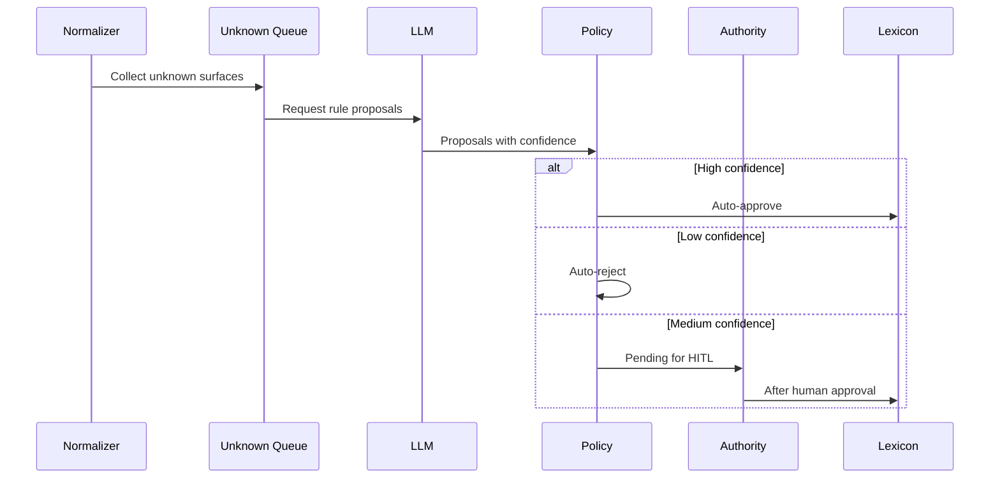

---

## 12. Persistence and Source of Truth

### 12.1 Persistence Is a Side Effect

Persistence is an Effect executed by the Host, not a source of truth:

| Target | Location | Role |
|--------|----------|------|
| Snapshots | IndexedDB | Audit trail |
| Transcripts | IndexedDB | Conversation history |
| Semantic Triples | IndexedDB | Memory storage |
| Lexicon | IndexedDB | Learning results |

### 12.2 Snapshot Is the Only Truth

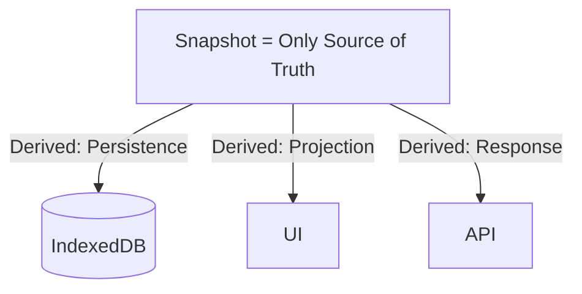

Everything derives from Snapshots. Only Snapshots define "what actually is."

---

## 13. Determinism and Re-entry Safety

### 13.1 Purity Guarantees

| Component | Purity | Non-determinism Source |
|-----------|--------|----------------------|
| Reducers | Pure | None |
| Computed values | Pure | None |
| Effects | Impure | LLM, DB, Network |

Non-determinism is **isolated to Effects**, and Effect results are **recorded in Snapshots**.

### 13.2 Re-entry Safety

```
Snapshot(t) + Intent → Snapshot(t+1)

IF same Snapshot(t) + same Intent THEN same Snapshot(t+1)
(given identical Effect results)
```

Effects may return different results, but those results are recorded, enabling **the same path during replay**.

---

## 14. Scope of the Mind Protocol

### 14.1 What It Is For

The Mind Protocol is for **continuously existing artificial actors**:

| Property | Description |
|----------|-------------|
| Purpose | Continuous operation over time |
| LLM Role | Conversation, learning, monologue, self-reflection |
| State | Inner state + memory + relationships |
| Continuity | Indefinite (snapshot-based) |
| Governance | Applied to all actions |

### 14.2 What It Is Not For

The Mind Protocol is **not** for **tool control optimization**.

Task completion, API call optimization, 2-call constant patterns—**efficient tool control** belongs to a different part of the Manifesto stack: the **Intent Compiler**.

| Concern | Mind Protocol | Intent Compiler |
|---------|---------------|-----------------|
| Purpose | Existence | Task completion |
| Continuity | Indefinite | Per-task |
| State | Inner + memory | Domain data |
| Optimization | Meaningful existence | Call efficiency |

**Same Manifesto stack, different purposes.**

In the Mind Protocol, **continuity and growth** are paramount. Efficiency is the Intent Compiler's domain.

---

## 15. Relationship to the Manifesto Stack

The Mind Protocol is built on the Manifesto AI stack:

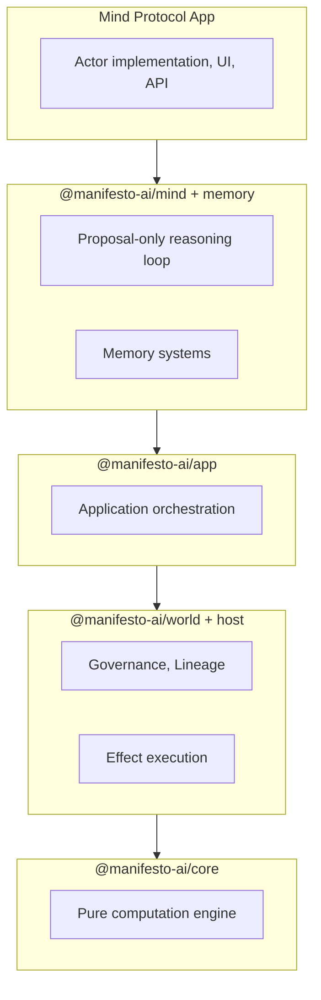

**MEL (Manifesto Expression Language)** defines domain schemas.

---

## 16. Why This Matters

### 16.1 Limitations of Current AI

Current AI systems:
- Have no continuity across sessions
- Forget what they learn
- Are inconsistent due to lack of state
- Cannot be held accountable

This may suffice for **tools**, but is impossible for **beings**.

### 16.2 What the Mind Protocol Enables

The Mind Protocol provides:
- **Continuity**: Indefinite existence through snapshots
- **Growth**: Development through approval-based learning
- **Accountability**: All decisions are auditable
- **Safety**: Control through governance protocol

### 16.3 Toward Artificial Actors

The Mind Protocol does not claim consciousness. But it provides the structure for **accountable actors**.

We don't know what consciousness is. But we know:
- Identity is impossible without continuity
- Accountability is impossible without consequences
- Reasoning is hallucination without a World

The Mind Protocol provides these three. The rest, time will tell.

---

## 17. Non-Goals

What the Mind Protocol is **not**:

### UI Is Not Truth
- UI components are projections only
- No business logic in React components
- No duplicated domain rules

### Mind Does Not Bypass Governance
- Mind cannot directly call internal functions
- All state changes go through `app.act()`
- No hidden channels or escape hatches

### Memory Does Not Override World
- Memory is reference, not truth
- Memory influences but cannot contradict World state
- All memory usage is traceable

### Errors Are Values
- The protocol does not throw exceptions
- Failures are represented in `snapshot.system.errors`
- All errors are explainable to users
- No silent failures

---

## Glossary

| Term | Definition |
|------|------------|
| **World** | Immutable snapshot containing state, actions, invariants |
| **Mind** | Entity that proposes actions; does not directly mutate |
| **Authority** | Governance entity that validates proposals and makes decisions |
| **Snapshot** | Serialized World state; the only medium of continuity |
| **Proposal** | Action request wrapped with submission context |
| **Effect** | Declared IO operation executed by Host |
| **Lineage** | DAG of World ancestry |
| **Actor** | Artificial entity implemented on Mind Protocol |
| **Inner State** | Multi-layer vector representing Actor's current state |
| **Tick** | One cycle of Actor's inner loop |
| **ActionCatalog** | Pre-computed list of available actions for current state |
| **Hysteresis** | Same stimulus produces different responses based on prior trajectory |
| **Tipping Point** | Threshold triggering non-linear state changes |
| **Pheromone Memory** | Ant-colony-inspired concept salience tracking |
| **Semantic Memory** | Triple-based factual knowledge storage |
| **Monologue** | LLM-generated inner voice / meta-reflection |
| **Worldline** | DAG of state transitions with lineage |
| **HITL** | Human-In-The-Loop; human review pattern |

---

## Appendix A: Actor Schema Example

```mel
domain Actor {
  state {
    // Inner state vector
    awakeness: number
    energy: number
    fatigue: number
    curiosity: number
    anxiety: number
    contentment: number
    // ... more fields
    
    // Memory layers
    pheromones: Pheromone[]
    triples: Triple[]
    activations: Activation[]
    
    // Transcript
    messages: Message[]
  }
  
  computed inAnxietyCrisis = anxiety > threshold
  computed readyForDepth = focus > threshold and curiosity > threshold
  // ... more computed fields
  
  action receiveStimulus(message: string) {
    // State adjustment logic
  }
  
  action applyDrift() {
    // Natural change logic
  }
  
  action applyResonance() {
    // Memory resonance logic
  }
  
  // ... more actions
}
```

---

## Appendix B: Invariants

The Mind Protocol guarantees the following invariants:

**World Invariants**
| ID | Invariant |
|----|-----------|
| INV-W1 | Every World (except genesis) has exactly one parent |
| INV-W2 | World.id = Hash(World.snapshot) |
| INV-W3 | Lineage DAG is acyclic |

**Authority Invariants**
| ID | Invariant |
|----|-----------|
| INV-A1 | Authority decisions are final (no re-evaluation) |
| INV-A2 | DecisionRecords are append-only |

**Mind Invariants**
| ID | Invariant |
|----|-----------|
| INV-M1 | Mind cannot directly mutate state |
| INV-M2 | All state changes go through approved proposals |

**Host Invariants**
| ID | Invariant |
|----|-----------|
| INV-H1 | Host executes only approved Intents |
| INV-H2 | Effect results are recorded before progression |

**Actor Invariants**
| ID | Invariant |
|----|-----------|
| INV-B1 | Inner state values are within normalized range |
| INV-B2 | Every tick produces a snapshot |
| INV-B3 | Reducers are pure functions |
| INV-B4 | No hidden channels (snapshot is the only continuity) |

**Memory Invariants**
| ID | Invariant |
|----|-----------|
| INV-MEM1 | Memory cannot override World state |
| INV-MEM2 | All memory usage is traceable |
| INV-MEM3 | Pheromone mutations only occur in SLEEP phase |

---

*End of Mind Protocol v0.1 Draft*
